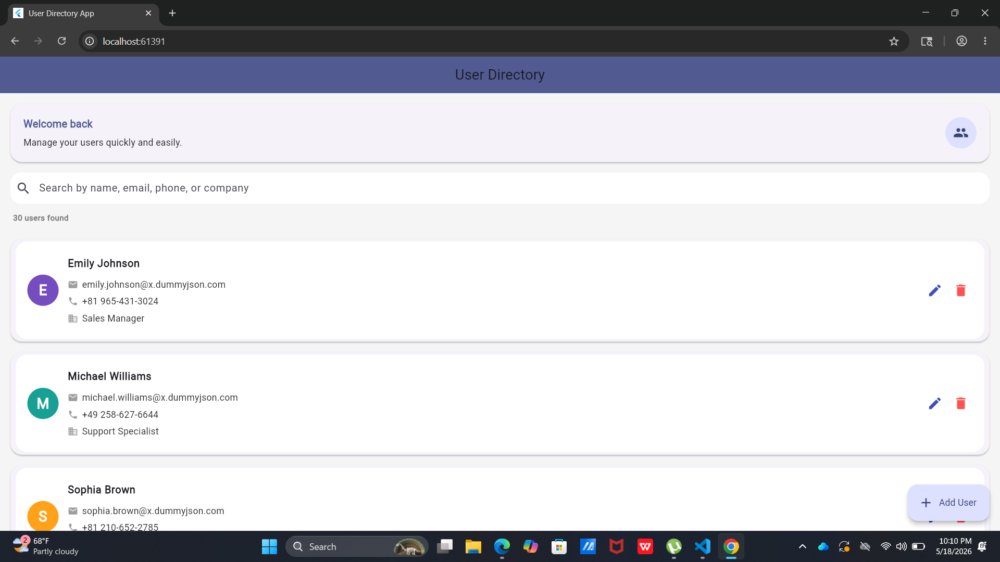
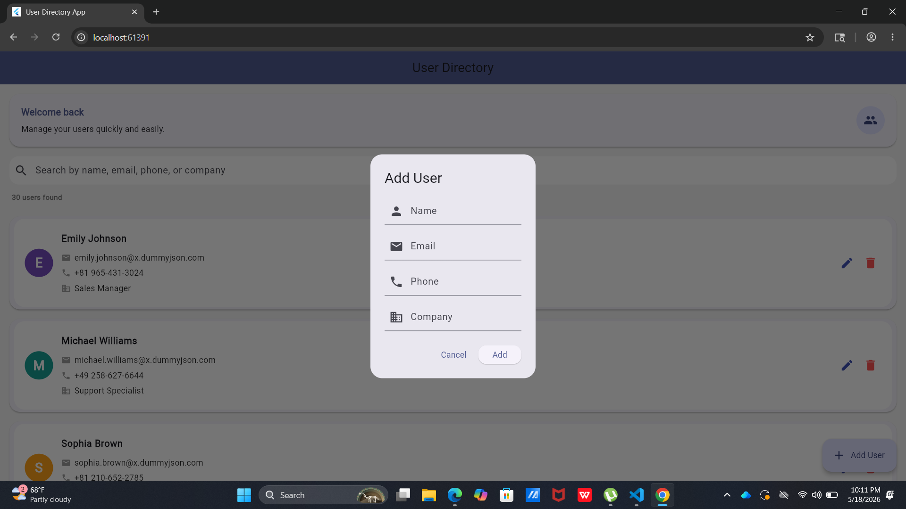
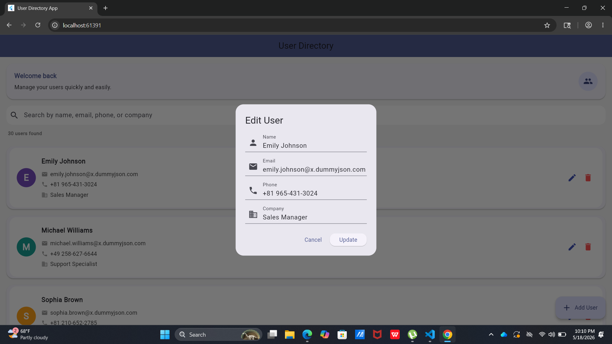

Flutter User Directory App
 A Flutter CRUD application that manages users using Provider state management and the http package for API consumption.
Features
 - View all users, Add new users, Update user information ,Delete users, Loading indicators ,Error handling ,Clean architecture

Technologies Used
 - Flutter, Provider ,http package, REST API, DummyJSON API

 API Used :https://dummyjson.com/users

Project Structure

lib/
│
├── models/
├── providers/
├── screens/
├── services/
├── widgets/
└── main.dart

 Screenshots

Home Screen

 Add User

 Edit User

   State Management
Provider was used for state management to efficiently manage UI updates and application data.
   Networking
The http package was used for making REST API requests.

